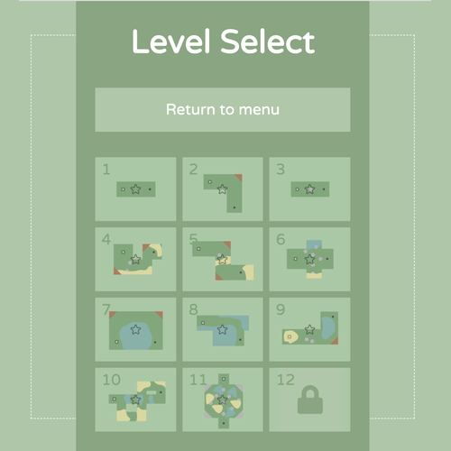

# MiniGolf

12-Hole MiniGolf. Made with HTML5, SVG, Phaser3, Figma, and MatterJS

# Created by
[Richard Hayes](https://richardhay.es/) 😊 and [Diana Dai](http://dianayu.org/) 🌹

# Live Demo

[View Live Demo](https://regularmemory.blog/MiniGolf/)

# Screenshot

# Controls

Left click with the `mouse` to operate in-game menu and putt the ball

# Credits

## Sounds from
https://opengameart.org/
https://freesound.org/
https://www.bensound.com/

## Required Attribution

"Water, Pouring, A.wav" by InspectorJ (www.jshaw.co.uk) of Freesound.org
https://freesound.org/people/InspectorJ/sounds/421184/

"Water Swirl, Small, 5.wav" by InspectorJ (www.jshaw.co.uk) of Freesound.org
https://freesound.org/people/InspectorJ/sounds/398711/

https://opengameart.org/content/completion-sound

Credit "Kenney.nl"
https://opengameart.org/content/51-ui-sound-effects-buttons-switches-and-clicks

https://opengameart.org/content/12-3-knocks-wooden-doors

https://opengameart.org/content/lego-bricks

Impact by Iwan 'qubodup' Gabovitch http://opengameart.org/users/qubodup
https://opengameart.org/content/impact
